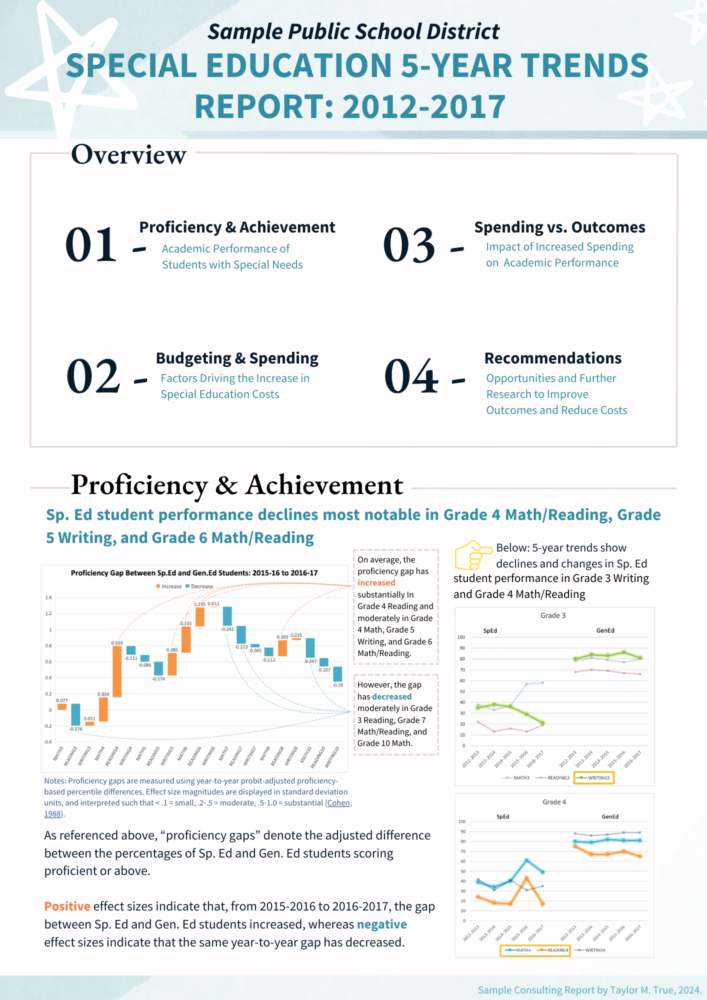
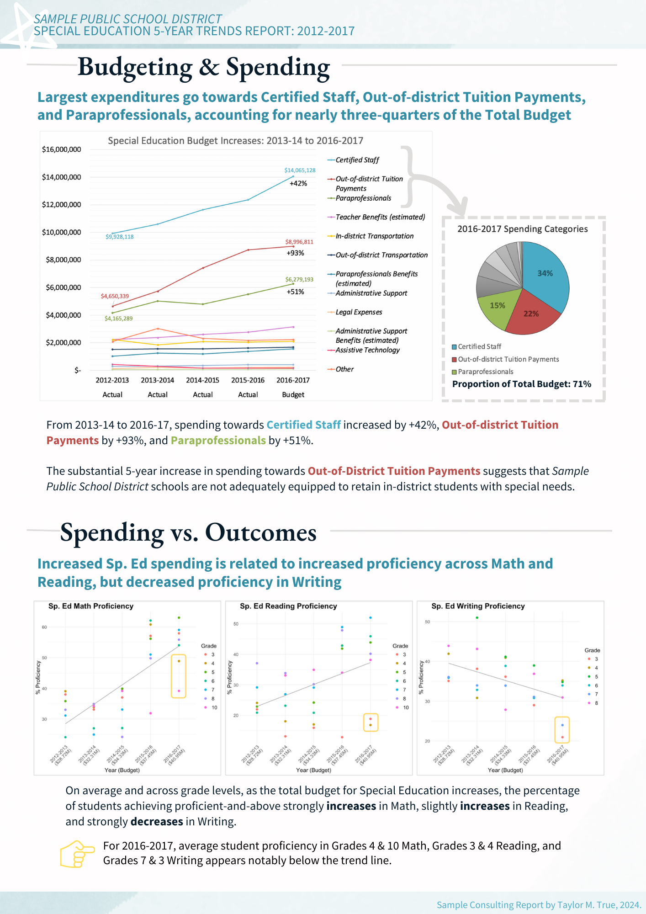
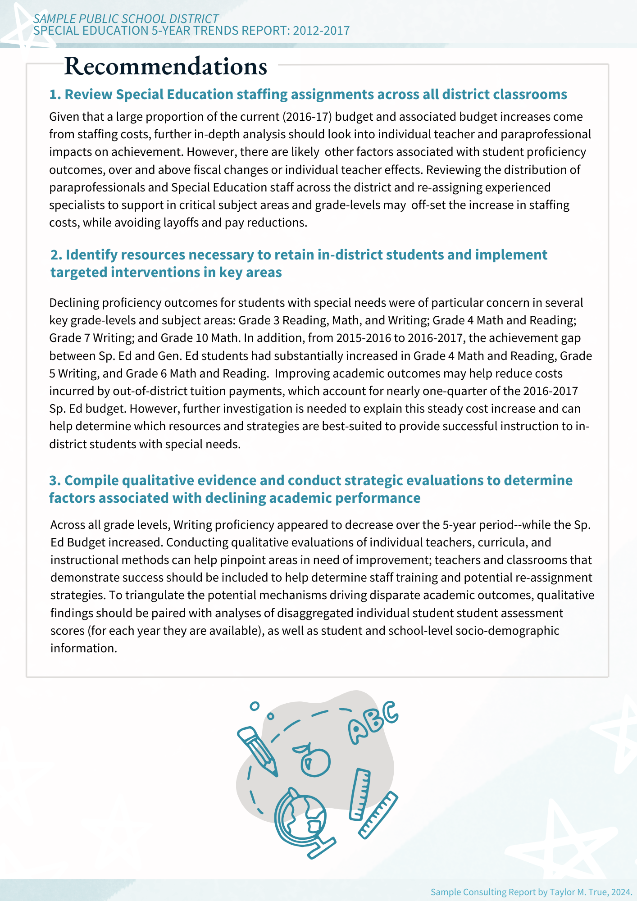

# Sample-Consulting-Project

<h2>Consulting Project: <i>Sample School District</i> Special Education 5-year Trends Report</h2>
Taylor M. True, August 2024
 
This project is a speculative educational consulting project based on a fictional school district, using sample data manipulated and visually formatted using Excel and R Studio. The report has been formatted to be used as an internal report or slide deck briefing, and is intended for an audience with a minimal to moderate technical background. 
 
 
This report is aimed at elucidating the following concerns: 1) How students enrolled in Special Education (Sp. Ed) are performing academically; 2) Reasons as to why spending has increased in Special Education; 3) If increased spending is associated with improved academic outcomes; 4) Recommendations to reduce costs and/or improve academic outcomes. 
  

<a href="Taylor_True_Consulting_SampleReportDeck.pdf" target="_blank">Click to download PDF.</a>
  

  

